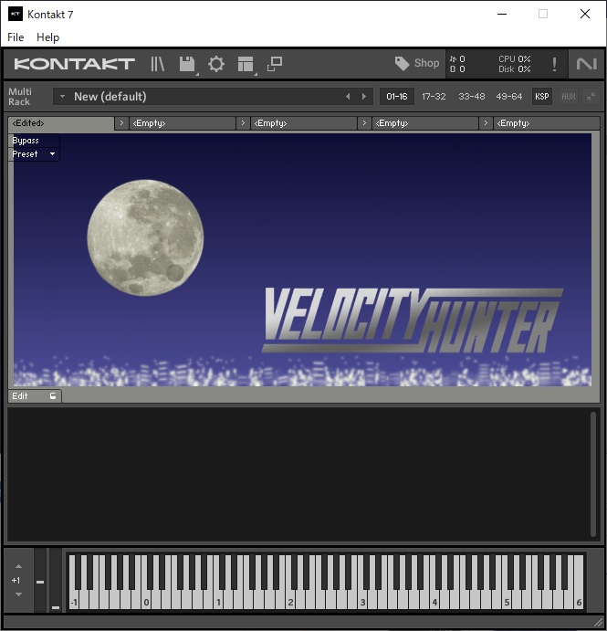

VelocityHunter
===

## DESCRIPTION

KONTAKT fixed velocity multiscript.

## INSTALL

1. Create 'VelocityHunter' folder in the following folder and put png files and txt files.

+ Mac: /Users/(Your Name)/Documents/Native Instruments/Kontakt 7/pictures
+ Windows: C:\Users\(Your Name)\Documents\Native Instruments\Kontakt 7\pictures

2. Click the KSP button on KONTAKT to open the multiscript pane.

3. Click the Edit tab to open the editor and paste the source code of VelocityHunter.ksp.

4. Press the Apply button.

## License

VelocityHunter is licensed under MIT License.  
Copyright 2023, aike (@aike1000)

